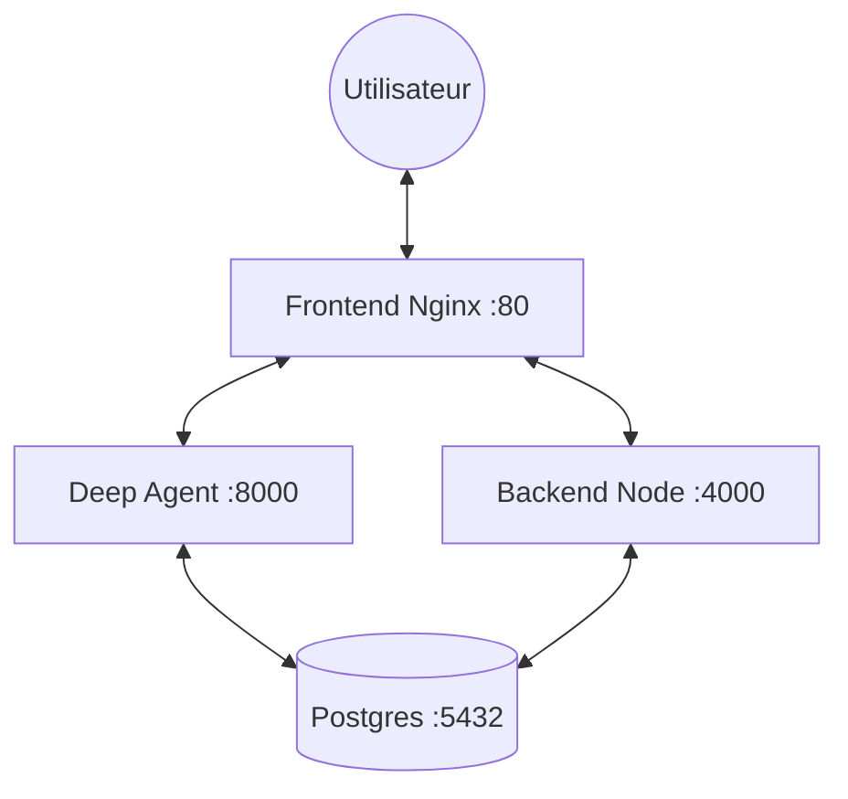

# Conteneurisation & Déploiement Docker 🐳

Ce guide explique comment lancer et gérer l'Assistant Devis dans un environnement conteneurisé. Cette approche est recommandée pour le déploiement en production (ex: Dokploy).

## 🏗️ Architecture Docker

Le projet utilise `docker-compose` pour orchestrer quatre services principaux :



### Détails des conteneurs :
1.  **Frontend** : Serveur Nginx servant l'application React buildée.
2.  **Backend** : Serveur Node.js (Express) gérant la logique métier et l'envoi de documents.
3.  **Agent IA** : Micro-service Python (FastAPI/LangGraph) pour l'intelligence artificielle.
4.  **Database** : Base de données PostgreSQL 15 avec persistance des données via volumes.

---

## 🚀 Guide de Démarrage Rapide

### 1. Préparation de l'environnement
Copiez le fichier de configuration à la racine :
```bash
cp .env.example .env
```
Éditez le fichier `.env` pour y insérer vos clés d'API (WhatsApp, OpenRouter, etc.).

### 2. Lancement de la stack
Construisez et démarrez tous les services en mode détaché :
```bash
docker-compose up --build -d
```

### 3. Vérification
Vérifiez que tous les services sont "Up" :
```bash
docker-compose ps
```

---

## 🛠️ Configuration Technique

### Variables d'Orchestration
Docker Compose utilise un fichier `.env` à la racine pour les variables "système" :
- `BACKEND_PORT`, `FRONTEND_PORT`, `AGENT_PORT`, `PGPORT` : Pour l'exposition des ports sur l'hôte.
- `BACKEND_URL`, `AGENT_URL` : Utilisés comme arguments de build pour le Frontend.

### Persistance des données
Les données PostgreSQL sont stockées dans un volume nommé `postgres_data`. 
- **Point de montage** : `/var/lib/postgresql` (conforme aux images Postgres 18+).

### Initialisation automatique
Lors du premier lancement, Postgres exécute automatiquement le script `backend/src/models/init.sql` monté dans `/docker-entrypoint-initdb.d/`.

---

---

## ☁️ Installation sur VM Ubuntu (Dokploy)

### 1. Préparation du serveur (VPS/VM)
Connectez-vous à votre VM Ubuntu (22.04 ou 24.04 recommandée) et préparez le système :
```bash
sudo apt update && sudo apt upgrade -y
```
Assurez-vous que les ports **80**, **443** et **3000** sont ouverts dans votre pare-feu (Security Groups).

### 2. Installation de Dokploy
Lancez le script d'installation automatique recommandé. **Ce script installera automatiquement Docker et les dépendances nécessaires** s'ils ne sont pas déjà présents sur votre système. 

**Important :** Utilisez `sudo` devant le `sh` pour que le script ait les permissions root :
```bash
curl -sSL https://dokploy.com/install.sh | sudo sh
```
Une fois l'installation terminée (comptez 2-3 minutes), Dokploy sera accessible sur `http://votre_ip_serveur:3000`.

### 3. Configuration initiale
1.  Créez votre compte administrateur sur l'interface web.
2.  Dans le menu **Projects**, créez un nouveau projet (ex: `Invoice Assistant`).
3.  Ajoutez un nouveau service de type **Compose**.
4.  Connectez votre dépôt Git et sélectionnez la branche principale.

### 4. Gestion des secrets
Dans l'onglet **Environment Variables** de votre service Compose sur Dokploy, copiez-collez le contenu de votre fichier `.env` local. Dokploy injectera automatiquement ces variables lors du build et du lancement des conteneurs.

### 5. Déploiement
Cliquez sur **Deploy**. Dokploy va cloner le dépôt, lire votre `docker-compose.yml` et orchestrer toute la stack automatiquement.
